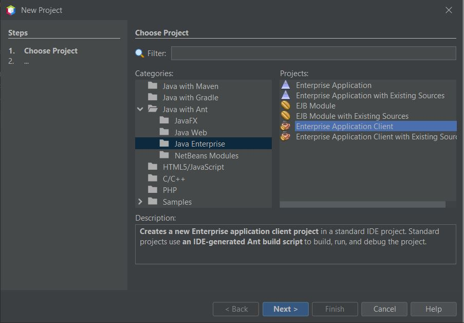
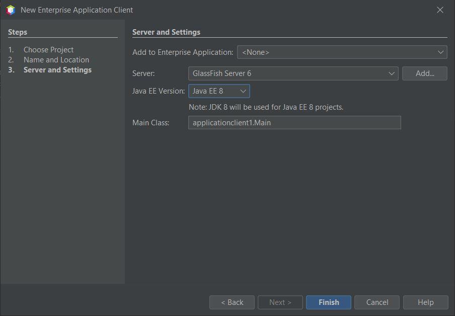

# Creating and Running an Application Client on the GlassFish Server

*This is using NetBeans 12.4 and Glassfish 6.0*

This tutorial shows how to create a simple application client and access an Enterprise JavaBean (EJB) deployed to GlassFish server 3. In this tutorial you will first create an enterprise applications that contains a simple session bean and a Java class library project that contains a remote interface for the session bean. You will then create an application client that accesses the session bean through the remote interface in the class library. The class library JAR that contains the remote interface is added to the classpath of the enterprise application and the application client.

## Creating the Java Class Library

In this section you will create a Java Class Library project that will contain the remote interface for the EJB. The remote interface behaves as an API for the EJB that is used by clients to communicate with the EJB.

The library JAR is easy to distribute to any clients that may need to call the EJB. Clients that want to access the EJB only need to add the library JAR to the project classpath. The EJB implementation uses the same JAR to implement the interface.


1. Choose `File` > `New Project` > `Java with ANT` > `Java Class Library`. Click Next.
2. Type **EJBRemoteInterface** for the Project Name. Click Finish.

When you click Finish, the IDE creates a Java Class Library project. In the next section you will create a Java EE enterprise application and an EJB module. You will then use a wizard to create a session bean and the remote interface for your session bean in the Class Library project. The application client will access the session bean via the interface in the class library.


## Creating an EJB Module

In this section you will create an enterprise application and an EJB module. When you create an EJB, the EJB should be created as part of an enterprise application and packaged as an EAR archive and deployed in to the server.


### Creating the Enterprise Application

In this section you will use the New Project wizard to create an enterprise application containing an EJB module. The wizard provides an option to create an EJB module when you create the application.

1. Choose File > New Project and select Enterprise Application in the Java EE category. Click Next.
2. Type **EntAppEJB** for the Project Name. Click Next.
3. Select GlassFish Server for the Server.
4. Confirm that Create EJB Module is selected and deselect Create Web Application Module. Click Finish.


When you click Finish, the IDE creates an enterprise application and an EJB module. In the Projects window, you can see that the EJB Module project is listed under the Java EE Modules node of the enterprise application project.


You can see that three types of projects are now listed in the Projects window: class library, enterprise application and EJB module.


### Creating the Session Bean

In this exercise you will use a wizard to create a session bean in the EJB module project. In the wizard you will also create a remote interface for the session bean in the Class Library project.

1. Right-click the EJB module project and choose New > Session Bean.
2. Type **MySession** for the EJB Name.
3. Type **ejb** for the Package.
4. Select Stateless for the Session Type.
5. Select the Remote option for Create Interface.
6. Select the **EJBRemoteInterface** project from the dropdown list. Click Finish.


When you click Finish, the IDE creates the session bean in the  ``ejb``  package in the EJB module *(EntAppEJB)* and opens the class in the editor. You can see that  ``MySession``  implements the  ``MySessionRemote``  interface and that the EJBRemoteInterface JAR was added as a library of the EJB module.

The wizard also creates a remote interface named  ``MySessionRemote``  in the  ``ejb``  package of the EJBRemoteInterface project. The IDE automatically adds the Java EE 6 API Library that is required for the EJB interface.


### Adding a Business Method

In this exercise you will create a simple business method in the session bean that returns a string.

1. Right-click in the editor of MySession and choose Insert Code (Alt-Insert; Ctrl-I on Mac) and select Add Business Method.
2. Type *getResult* for the Method Name and String for the Return Type. Click OK.
3. Make the following changes to modify the  ``getResult``  method to return a String.

The class should look like the following.


```java

@Stateless
public class MySession implements MySessionRemote {

    public String getResult() {
        return "This is My Session Bean";
    }
}
```
Save your changes.

You now have an enterprise application with a simple EJB that is exposed through a remote interface. You also have an independent class library that contains the EJB interface that can be distributed to other developers. Developers can add the library to their projects if they want to communicate with the EJB that is exposed by the remote interface and do not need to have the sources for the EJB. When you modify the code for the EJB, you only need to distribute a JAR of the updated class library if any of the interfaces change.

When you use the Add Business Method dialog, the IDE automatically implements the method in the remote interface.


### Deploying the Enterprise Application

You can now build and run the enterprise application. When you run the application, the IDE will deploy the EAR archive to the server.

1. Right-click the EntAppEJB enterprise application and choose Deploy.

When you click Deploy, the IDE builds the enterprise application and deploys the EAR archive to the server. If you look in the Files window you can see that the EJBRemoteInterface JAR is deployed with the application.

In the Services window, if you expand the Applications node of GlassFish Server you can see that EntAppEJB was deployed.


## Creating the Application Client

In this section you will create an enterprise application client. When creating the application client, the project needs the EJBRemoteInterface Java class library as a library in order to reference the EJB.

When you run the enterprise application, the IDE will package the application client and the Java class library JAR in the EAR archive. Library JARs must be packaged in an EAR with the application client if you want to access the JARs from the application client.


### Creating the Enterprise Application

In this exercise you will use the New Project wizard to create an application client project. If you are deploying to GlassFish 3.1 or 4.x you can create and run an application client as a standalone project. The application client no longer needs to be deployed and run as part of an enterprise application.

NOTE: If you are deploying to GlassFish 3.0.1, you need to create the application client as a module in an enterprise application project and run the enterprise application.

1. Choose File > New Project and select `Enterprise Application Client` in the Java EE category. Click Next.
2. Type **EntAppClient** for the Project Name. Click Next.
3. Select GlassFish Server for the Server. Click Finish.

Note that you do not need to add the project to an enterprise application.



When you click Finish, the IDE creates the application client project and opens  ``Main.java``  in the editor.



### Adding the Class Library

The class library that contains the remote interface now needs to be added to the classpath of the project to enable the application client to reference the EJB. The class library project is open, so you can use the Call Enterprise Bean dialog to help you generate the code to call the EJB.

If the class library project is not open, you can add the class library to the project in the Projects window by right-clicking the Libraries node and locating the JAR of the EJBRemoteInterface project.

1. Expand the Source Packages node of the EntAppClient project and open  ``Main.java``  in the editor. (`EntAppClient > Source Packages > entappclient > Main.java`)
2. Right-click in the source code and choose Insert Code (Alt-Insert) and select Call Enterprise Bean to open the Call Enterprise Bean dialog. (or press alt + insert then select Call Enterprise Bean)
3. Expand the EntAppEJB project node (EntAppEJB-ejb) and select MySession. Click OK.


The dialog automatically selects Remote as the interface type. When you click OK, the IDE adds the following annotation to  ``Main.java`` .


```java
@EJB 
private static MySessionRemote mySession;
```

The IDE also automatically adds EJBRemoteInterface as a project Library.

Modify the  ``main``  method to retrieve the String of the  ``getResult``  method via the MySessionRemote interface. Save your changes.

```java
public static void main(String[] args) {
    System.err.println("result = " + mySession.getResult());
    }
```

## Running the Application Client

You can now run the application client by building and deploying the EntAppClient project.

1. Right-click the EntAppClient project in the Projects window and choose Run. (Alternatively, you can expand source package and right-click the  ``Main.java``  class and choose Run File)

When you click Run, the IDE builds the application client project and deploys the JAR archive to the server. You can see the message from the application client in the Output window.

If you want to create additional EJBs, you can simply add the new remote interfaces of the EJBs to the EJBRemoteInterface class library project.


*This is an updated version of the [Apache tutorial](https://netbeans.apache.org/kb/docs/javaee/entappclient.html)*
